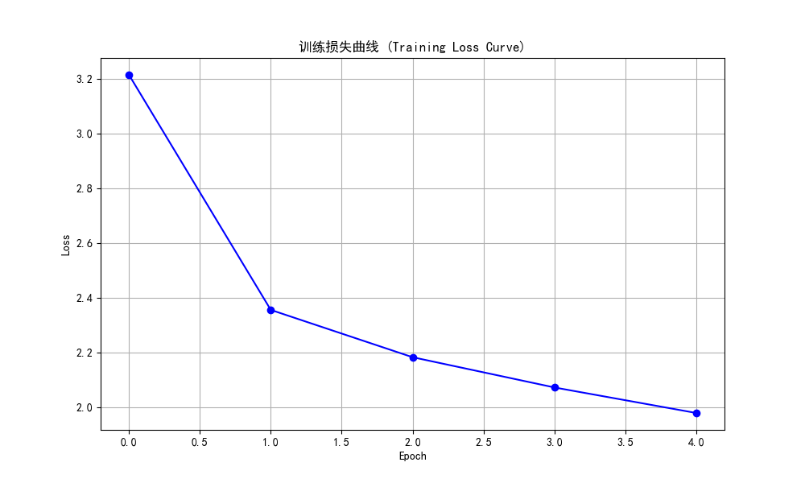
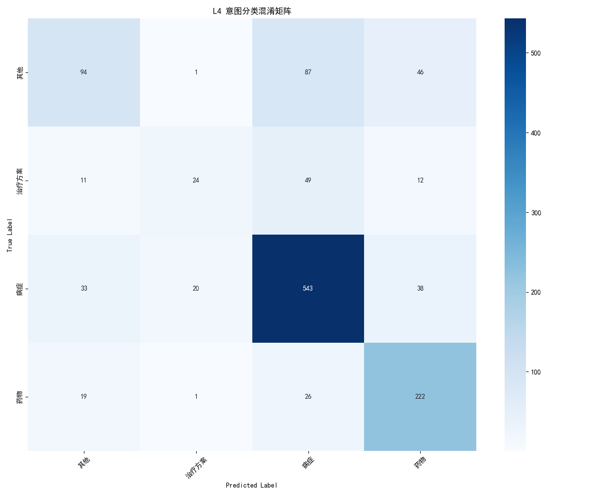
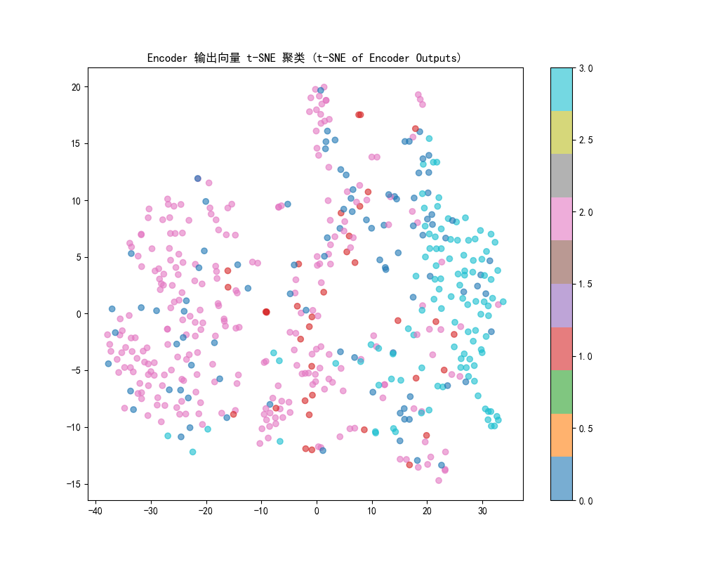
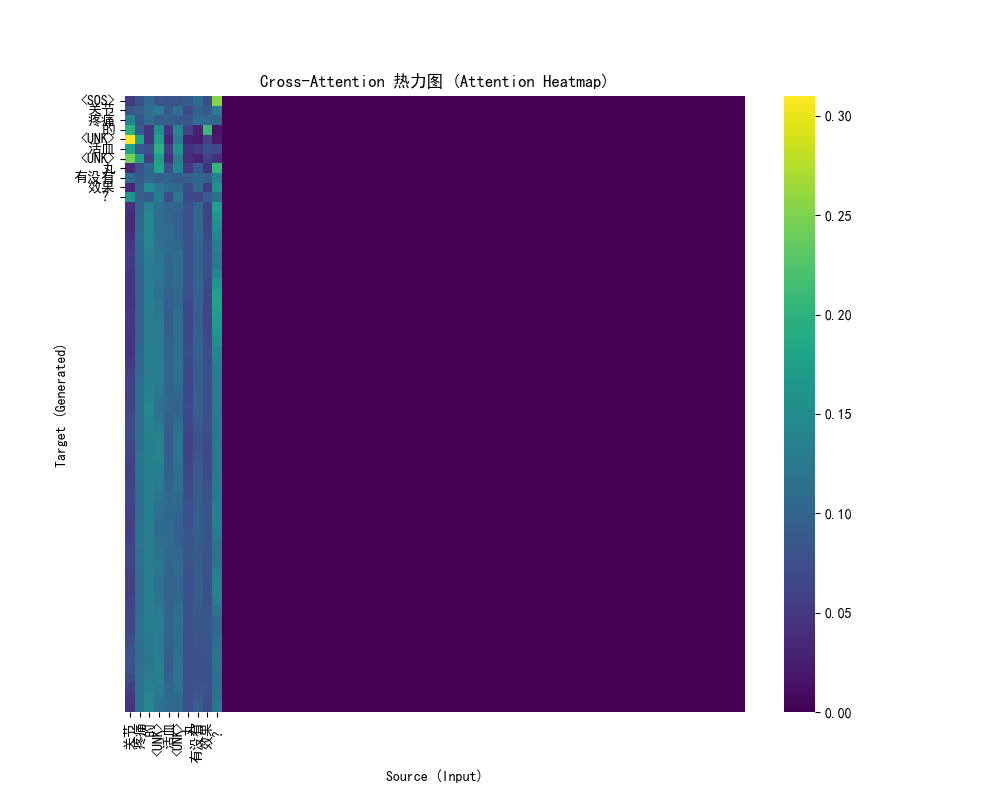

# CMID Multi-Task Transformer V2 Evaluation Report (Template-Based Decoder)

## 1. 核心指标汇总 (Core Metrics)

| Metric | Value |
| :--- | :--- |
| **Accuracy (L4)** | 0.7202 |
| **Macro-F1 (L4)** | 0.5988 |
| **Accuracy (L36)** | 0.4804 |
| **Macro-F1 (L36)** | 0.2762 |
| **BLEU-4 (Generation)** | 0.2407 |

## 2. 训练过程 (Training Process)



## 3. 分类混淆矩阵 (Confusion Matrix - L4)



## 4. t-SNE 聚类可视化 (t-SNE Visualization)



## 5. Cross-Attention 热力图 (Attention Heatmap)



## 6. RAG 检索实验结果 (New Rules)

```

Starting RAG Ablation (New Rules)...

--- Case 1 ---
Input: 前段时间发现龟头长了些颗粒，现在发现长得更多了，会痒，没有乱搞过，怀疑得了尖锐湿疣，有什么办法能治好？
GT Std: 查询 头 的具体操作步骤及实施方法。
Method A (Raw) ->: 查询 ， 的相关医疗信息。 (Score: 0.4066)
Method C (Rewrite): 查询 头 的标准治疗方案及手段。
Method C (Retrieval) ->: 查询 头 的标准治疗方案及手段。 (Score: 1.0000)

--- Case 2 ---
Input: 患有内痔七八年，干活多了或上火了就较严重,肛门内边会出现有大豆大的疙瘩,劳累后就会痛,有什么偏方可根除？
GT Std: 查询 有内 的标准治疗方案及手段。
Method A (Raw) ->: 查询关于 ,肛 的综合医疗信息解答。 (Score: 0.3543)
Method C (Rewrite): 查询 肛门 的标准治疗方案及手段。
Method C (Retrieval) ->: 查询 肛门 的标准治疗方案及手段。 (Score: 1.0000)

--- Case 3 ---
Input: 没有病史，这是第一次，医生说长了湿疣，在阴道上也长了，这样的情况下怎么治疗？
GT Std: 查询 阴道 的标准治疗方案及手段。
Method A (Raw) ->: 查询 ，下 的标准治疗方案及手段。 (Score: 0.4472)
Method C (Rewrite): 查询 阴道 的标准治疗方案及手段。
Method C (Retrieval) ->: 查询 阴道 的标准治疗方案及手段。 (Score: 1.0000)

=== Results ===
Method A (Raw Input) Recall@1: 0.1000
Method C (Ours)      Recall@1: 0.2800

```
